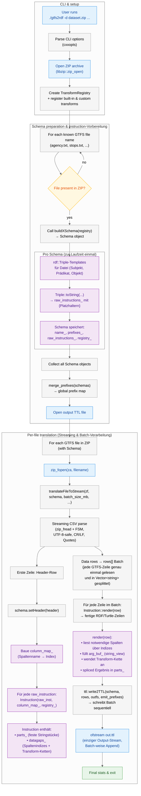

```mermaid
%%{init: {
  "theme": "neutral",
  "flowchart": {
    "curve": "basis",
    "nodeSpacing": 30,
    "rankSpacing": 40
  }
}}%%
flowchart TD

    %% Node styles
    classDef io fill:#e3f2fd,stroke:#1e88e5,stroke-width:1px,color:#0d47a1;
    classDef compute fill:#f5f5f5,stroke:#9e9e9e,stroke-width:1px;
    classDef decision fill:#fff8e1,stroke:#ffb300,stroke-width:1px,color:#e65100;
    classDef finalNode fill:#e8f5e9,stroke:#43a047,stroke-width:1px,color:#1b5e20;
    classDef meta fill:#f3e5f5,stroke:#8e24aa,stroke-width:1px,color:#4a148c;

    %% --- CLI & setup ---
    subgraph CLI ["CLI & setup"]
        A["User runs<br/>./gtfs2rdf -d dataset.zip ..."]:::io
        B["Parse CLI options<br/>(cxxopts)"]:::compute
        C["Open ZIP archive<br/>(libzip::zip_open)"]:::io
        D["Create TransformRegistry<br/>+ register built-in & custom transforms"]:::compute

        A --> B --> C --> D
    end

    %% --- Schema preparation + Instruction-Vorbereitung ---
    subgraph SchemaPrep ["Schema preparation & Instruction-Vorbereitung"]
        E["For each known GTFS file name<br/>(agency.txt, stops.txt, ...)"]:::compute
        F{"File present in ZIP?"}:::decision
        G["Call buildXSchema(registry)<br/>→ Schema object"]:::compute

        subgraph SchemaInternals ["Pro Schema (zur Laufzeit einmal)"]
            G1["rdf::Triple-Templates<br/>für Datei (Subjekt, Prädikat, Objekt)"]:::meta
            G2["Triple::toString(...)<br/>→ raw_instructions_ mit {Platzhaltern}"]:::meta
            G3["Schema speichert:<br/>name_, prefixes_, raw_instructions_, registry_"]:::meta
        end

        H["Collect all Schema objects"]:::compute
        I["merge_prefixes(schemas)<br/>→ global prefix map"]:::compute
        J["Open output TTL file"]:::io

        D --> E
        E --> F
        F -->|no| E
        F -->|yes| G --> G1 --> G2 --> G3 --> H --> I --> J
    end

    %% --- Per-file translation ---
    subgraph Translation ["Per-file translation (Streaming & Batch-Verarbeitung)"]
        K["For each GTFS file in ZIP<br/>(with Schema)"]:::compute
        L["zip_fopen(za, filename)"]:::io
        M["translateFileToStream(zf, schema, batch_size_mb, ...)"]:::compute
        N["Streaming CSV parse<br/>(zip_fread + FSM,\nUTF-8-safe, CR/LF, Quotes)"]:::compute

        %% Header-Bindung → Instructions sind fertig
        O["Erste Zeile: Header-Row"]:::compute
        O1["schema.setHeader(header)"]:::compute
        O2["Baue column_map_<br/>(Spaltenname → Index)"]:::meta
        O3["Für jede raw_instruction:<br/>Instruction(raw_inst, column_map_, registry_)"]:::meta
        O4["Instruction enthält:<br/>• parts_ (feste Stringstücke)<br/>• datagaps_ (Spaltenindizes + Transform-Ketten)"]:::meta

        %% Datenzeilen / Batches
        P["Data rows → rows[] Batch<br/>(jede GTFS-Zeile genau einmal gelesen<br/>und in Vector&lt;string&gt; gesplittet)"]:::compute
        P1["Für jede Zeile im Batch:<br/>Instruction::render(row)<br/>→ fertige RDF/Turtle-Zeilen"]:::compute
        P2["render(row):<br/>• liest notwendige Spalten über Indizes<br/>• füllt arg_buf_ (string_view)<br/>• wendet Transform-Kette an<br/>• spliced Ergebnis in parts_"]:::meta

        Q["ttl::write2TTL(schema, rows, outfs, emit_prefixes)<br/>→ schreibt Batch sequentiell"]:::compute
        R["ofstream out.ttl<br/>(einziger Output-Stream,\nBatch-weise Append)"]:::io
        S["Final stats & exit"]:::finalNode

        J --> K --> L --> M --> N

        %% Header-Pfad
        N --> O
        O --> O1 --> O2 --> O3 --> O4

        %% Datenpfad
        N --> P --> P1 --> P2 --> Q --> R --> S
    end
```