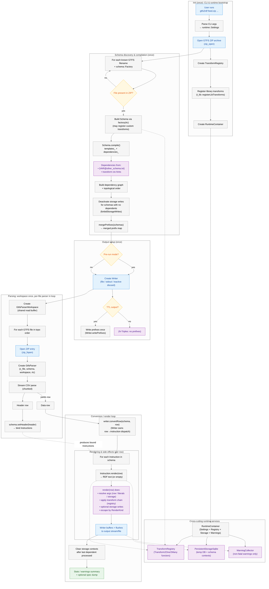

```mermaid
        %%{init: {
    "theme": "neutral",
    "flowchart": {
        "curve": "basis",
        "nodeSpacing": 30,
        "rankSpacing": 40
    }
    }}%%
    flowchart TD

    %% Node styles
    classDef io fill:#e3f2fd,stroke:#1e88e5,stroke-width:1px,color:#0d47a1;
    classDef compute fill:#f5f5f5,stroke:#9e9e9e,stroke-width:1px;
    classDef decision fill:#fff8e1,stroke:#ffb300,stroke-width:1px,color:#e65100;
    classDef finalNode fill:#e8f5e9,stroke:#43a047,stroke-width:1px,color:#1b5e20;
    classDef meta fill:#f3e5f5,stroke:#8e24aa,stroke-width:1px,color:#4a148c;

    %% --- Cross-cutting runtime services (span most phases) ---
    subgraph Services ["Cross-cutting runtime services"]
        S0["RuntimeContainer<br/>(Settings + Registry + Storage + Warnings)"]:::compute

        S1["TransformRegistry<br/>(Transform2One/2Many functors)"]:::meta
        S2["PersistentStorageSqlite<br/>(temp DB + schema contexts)"]:::meta
        S3["WarningCollector<br/>(non-fatal warnings only)"]:::meta

        S0 --> S1
        S0 --> S2
        S0 --> S3
    end

    %% --- 1) Init: CLI & runtime bootstrap (once) ---
    subgraph Init ["Init (once): CLI & runtime bootstrap"]
        A["User runs<br/>gtfs2rdf feed.zip ..."]:::io
        B["Parse CLI args<br/>→ runtime::Settings"]:::compute
        C["Open GTFS ZIP archive<br/>(zip_open)"]:::io

        D["Create TransformRegistry"]:::compute
        D1["Register library transforms<br/>(t_lib::registerLibTransforms)"]:::compute
        E["Create RuntimeContainer"]:::compute

        A --> B --> C --> D --> D1 --> E
        E --> S0
    end

    %% --- 2) Schema discovery & compilation (once) ---
    subgraph SchemaPhase ["Schema discovery & compilation (once)"]
        F["For each known GTFS filename<br/>+ schema::Factory"]:::compute
        G{"File present in ZIP?"}:::decision
        H["Build Schema via factory(rtc)<br/>(may register custom transforms)"]:::compute
        I["Schema.compile()<br/>templates_ + dependencies_"]:::compute

        I1["Dependencies from:<br/>• {VAR@other_schema.txt}<br/>• transform ctx-hints"]:::meta

        J["Build dependency graph<br/>+ topological order"]:::compute
        K["Deactivate storage writes<br/>for schemas with no dependents<br/>(forbidStorageWrites)"]:::compute
        L["mergePrefixes(schemas)<br/>→ merged prefix map"]:::compute

        C --> F
        F --> G
        G -->|no| F
        G -->|yes| H --> I --> I1 --> J --> K --> L

        %% registry can be extended while building schemas
        H -.-> S1
    end

    %% --- Output setup (once) ---
    subgraph OutputSetup ["Output setup (once)"]
        M{"Pre-run mode?"}:::decision
        N["Create Writer<br/>(file / stdout / inactive discard)"]:::io
        O{"TTL output?"}:::decision
        P["Write prefixes once<br/>(Writer.writePrefixes)"]:::compute
        Q0["(N-Triples: no prefixes)"]:::meta

        L --> M
        M -->|yes| N
        M -->|no| N --> O
        O -->|yes| P
        O -->|no| Q0
    end

    %% --- 3) Parsing (workspace once, per-file parser in loop) ---
    subgraph Parsing ["Parsing: workspace once, per-file parser in loop"]
        PW["Create GtfsParserWorkspace<br/>(shared read buffer)"]:::compute

        Q["For each GTFS file in topo order"]:::compute
        R["Open ZIP entry<br/>(zip_fopen)"]:::io
        T["Create GtfsParser<br/>(z_file, schema, workspace, rtc)"]:::compute

        U["Stream CSV parse (chunked)"]:::compute
        V["Header row"]:::compute
        W["schema.setHeader(header)<br/>→ bind Instructions"]:::compute

        X["Data row"]:::compute

        N --> PW --> Q
        Q --> R --> T --> U

        U --> V --> W
        U -->|"yields row"| X
    end

    %% --- 4) Conversion / render loop (writer dispatch + instruction rendering) ---
    subgraph Conversion ["Conversion / render loop"]
        Y["writer.convertRow(schema, row)<br/>(Writer owns row→instruction dispatch)"]:::compute

        subgraph Rendering ["Rendering & side effects (per row)"]
            Z["For each Instruction in schema"]:::compute
            Z1["Instruction.render(row)<br/>→ RDF text (or empty)"]:::compute
            Z2["render(row) does:<br/>• resolve args (row / literals / storage)<br/>• apply transform chain (registry)<br/>• optional storage writes<br/>• escape by RenderKind"]:::meta
            Z3["Writer buffers + flushes<br/>to output stream/file"]:::io
        end

        AA["Clear storage contexts<br/>after last dependent processed"]:::compute
        AB["Stats / warnings summary<br/>+ optional spec dump"]:::finalNode

        %% single, clean row→writer arrow
        X --> Y --> Z --> Z1 --> Z2 --> Z3 --> AA --> AB

        %% Instructions originate from schema (bound after header)
        W -. "produces bound Instructions" .-> Z

        %% runtime services used here
        Z1 -.-> S1
        Z1 -.-> S2
        Z3 -.-> S3
    end
```